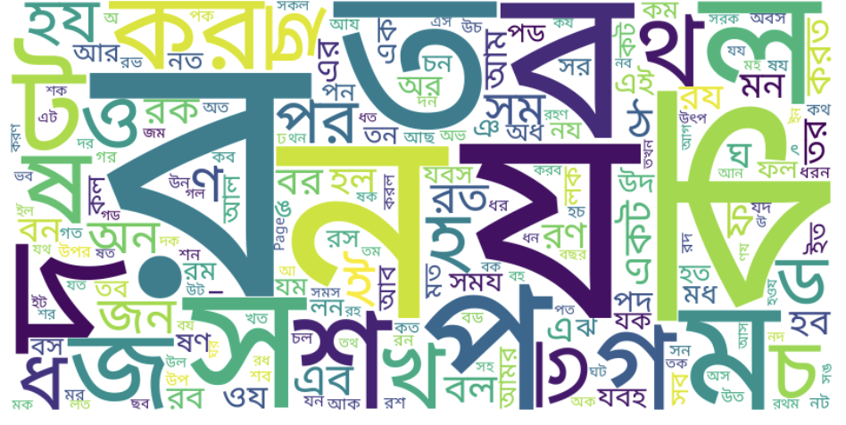

<div align="center">
<h1><span style="color:#800000; font-size:28px; font-family: 'Georgia';">Bangla-TextBook Corpus</span></h1>
</div>


<div align="center">
<table><tr>
<td><a href="https://md-nishat.com/"></a></td>
<td><a href="mailto:mraihan2@gmu.edu"></a></td>
</tr></table>
</div>

<p align="center">
  
</p>

---

## <span style="color:#006400; font-size:26px; font-family: 'Tahoma';">Dataset Statistics</span>

<table style="width:100%; border-collapse: collapse; font-family: 'Arial'; font-size:16px;">
  <tr style="background-color:#f2f2f2;">
    <th style="border: 1px solid #ddd; padding: 8px; color:#2E8B57;">Statistic</th>
    <th style="border: 1px solid #ddd; padding: 8px; color:#2E8B57;">Value</th>
  </tr>
  <tr>
    <td style="border: 1px solid #ddd; padding: 8px;">Total Tokens</td>
    <td style="border: 1px solid #ddd; padding: 8px;">9,897,623</td>
  </tr>
  <tr style="background-color:#f9f9f9;">
    <td style="border: 1px solid #ddd; padding: 8px;">Total Sentences</td>
    <td style="border: 1px solid #ddd; padding: 8px;">697,903</td>
  </tr>
  <tr>
    <td style="border: 1px solid #ddd; padding: 8px;">Number of Textbooks</td>
    <td style="border: 1px solid #ddd; padding: 8px;">163</td>
  </tr>
  <tr style="background-color:#f9f9f9;">
    <td style="border: 1px solid #ddd; padding: 8px;">Grade Range</td>
    <td style="border: 1px solid #ddd; padding: 8px;">6 - 12</td>
  </tr>
</table>

---

## <span style="color:#8B008B; font-size:26px; font-family: 'Courier New';">Uses & Applications</span>

<ul style="font-size:16px; color:#333333; font-family: 'Arial';">
  <li><span style="color:#B22222;">Language Model Pretraining:</span> Equip models with high-quality, context-rich Bangla academic content.</li>
  <li><span style="color:#B22222;">Benchmarking:</span> Serve as a standard for evaluating performance on Bangla language tasks.</li>
  <li><span style="color:#B22222;">Educational Tools:</span> Develop applications for language learning, content analysis, and educational research.</li>
  <li><span style="color:#B22222;">Cultural Research:</span> Preserve and analyze authentic Bangla linguistic and cultural expressions in an academic setting.</li>
</ul>

<div style="background-color:#FFFACD; padding:12px; border-left:6px solid #FF8C00; font-family: 'Georgia'; font-size:16px; margin-bottom:20px;">
  <strong>Note:</strong> This corpus emphasizes the importance of quality over quantity, providing a rich resource for the development of sophisticated Bangla language models.
</div>

---

## <span style="color:#2F4F4F; font-size:26px; font-family: 'Lucida Console';">How to Cite</span>

<p style="font-size:16px; color:#333333; font-family: 'Arial';">
If you use the <strong>Bangla-Instruct</strong> dataset or refer to the associated research, please cite the paper as follows:
</p>

```bibtex
@inproceedings{raihan2025tigerllm,
  title={TigerLLM - A Family of Bangla Large Language Models},
  author={Raihan, Nishat and Zampieri, Marcos},
  year={2025}
}
